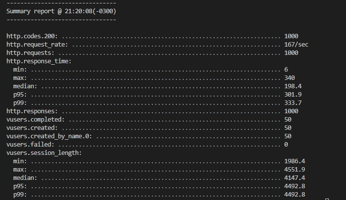
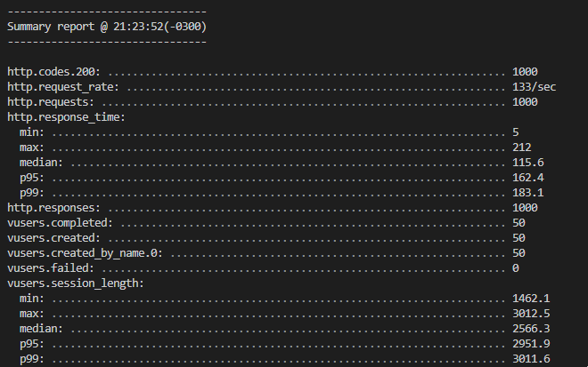
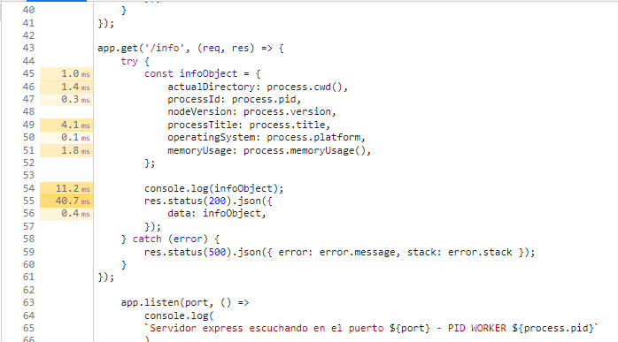
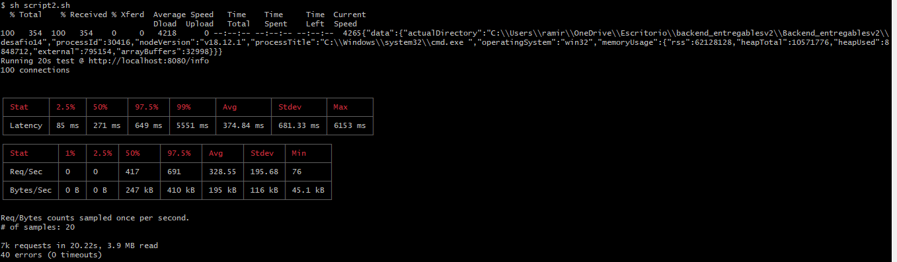

# Análisis de performance

Todo los tests fueron realizados en base al endpoint /info.

## Resultados con artillery

El test de carga con artillery fue realizado de tal modo de comparar los resultados tanto para el modo fork como para el modo cluster. Para el modo fork se ejecutaron los siguientes comandos en dos terminales: 

1. `npm run start:fork` para levantar el proyecto en modo fork.
2. `npm run artillery:fork` para realizar el test mediante artillery.

Se simularon 50 conexiones con 20 requests por cada una. Se obtuvieron los siguientes resultados:

Se respondieron 167 requests por segundo. La respuesta de menor tiempo fue de 6 milisegundos y la de mayor tiempo fue de 340 milisegundos. El tiempo promedio de respuesta fue 198.4 milisegundos.

Para el modo cluster se ejecutaron los siguientes comandos en dos terminales: 

1. `npm run start:cluster` para levantar el proyecto en modo cluster.
2. `npm run artillery:cluster` para realizar el test mediante artillery.

Se obtuvieron los siguientes resultados:

Se respondieron 133 requests por segundo. La respuesta de menor tiempo fue de 5 milisegundos y la de mayor tiempo fue de 212 milisegundos. El tiempo promedio de respuesta fue 115.6 milisegundos.

Claramente, el modo cluster permite obtener respuestas mucho más rapidas a comparación del modo fork.

## Resultados con profiling de node + artillery

El test de carga con profiling se llevo a cabo mediante los siguientes pasos:

1. Se ejecutó el comando `npm run start:profiling` de manera tal de levantar el proyecto en el puerto dado. Se crea el archivo isolate que estará escuchando todo los procesos que realizemos en la aplicación.
2. En otra terminal de comandos se ejecutó `sh script1.sh` el cual realiza el mismo proceso de artillery en cuestión (50 conexiones con 20 requests por cada una) y guarda los resultados en el archivo "result_profiling_info.txt".
3. Se finalizó el proceso de profiling y se renombró el archivo isolate a "isolate-script1.log".
4. Como el archivo isolate es ilegible para nosotros, con el comando `npm run start:profilingProcess` se transformó ese archivo al llamado "isolate-script1.txt", el cual sí va a ser legible para nosotros. 

Se observo que la aplicación se caracterizó por tener 2927 ticks. Un número no muy alto puesto que la ruta /info no es un endpoint que demande un trabajo forzoso al procesador.

## Resultados con node devtools de google chrome y profiling (modo inspecto de node)

Se realizó exactamente el mismo procedimiento que con node y artillery, solo que esta vez el proyecto es levantado con el comando `npm run start:inspect`. El modo inspecto de node de google chrome grabó el siguiente proceso (explicado en la sección anterior):

1. Ejecución del script 1.
2. Obtención del archivo isolate-script1.txt.
3. Finalizar la grabación del inspector de google chrome.

El inspector de node de google chrome devolvió los siguientes resultados en el código:

El console.log del objeto llevo un tiempo de duración de 11.2 milisegundos. Y la impresión del objeto mediante JSON tuvo una duración de 40.7 milisegundos. Claramente, esta herramienta nos está informado que esos dos funcionalidades en el código podrían optimizarse para que demanden menos tiempo de trabajo del procesador.

## Resultados con autocannon y 0x

Se realizó otro test con autocannon y 0x. Se siguieron los siguientes pasos:

1. Para correr el proyecto se ejecutó el comando `npm run start:0x`. 0x estará escuchando y evaluando todo lo que se realice mientras este en ejecución.
2. En otra terminal, se ejecutó el comando `sh script2.sh`, el cual simula 100 conexiones que se dan en un lapso de 20 segundos. El test se realizó mediante autocannon.

Se obtuvieron los siguientes resultados:

En cuanto a latencia se obtuvo un tiempo de duración de 374.84 milisegundos. Se respondieron en promedio 328.55 requests por segundo y se transfirieron 195 kB por segundo.

3. Luego, se finalizó el proceso de 0x y se generó la carpeta denominada "0x_flamegraph", que contendrá, entre otros archivos, el flamegraph.html que podremos visualizar en el navegador. 

Se podrá observar un flamegraph casi vacío, puesto que como mencioné previamente, el endpoint /info no conlleva un gran trabajo para el procesador. De todos modos, se podrá observar que las gráficas alcanzar una determinada altura, y es muy probable que esos puntos más oscuros de las mismas esten asociadas al console.log y al res.json que generaban más trabajo al procesador.

## Conclusión

Queda demostrado que el modo cluster es más eficiente que el modo fork para atender múltiples requests ante una cierta cantidad de conexiones. Los tests de profiling, artillery, 0x y autocannon han arrojado que la ruta /info podría optimizarse más, eliminando por ejemplo el console.log de infoObject, imprimir el objeto de otra manera reemplazando el res.json y/o ejecutar el endpoint de manera asíncrona. 

